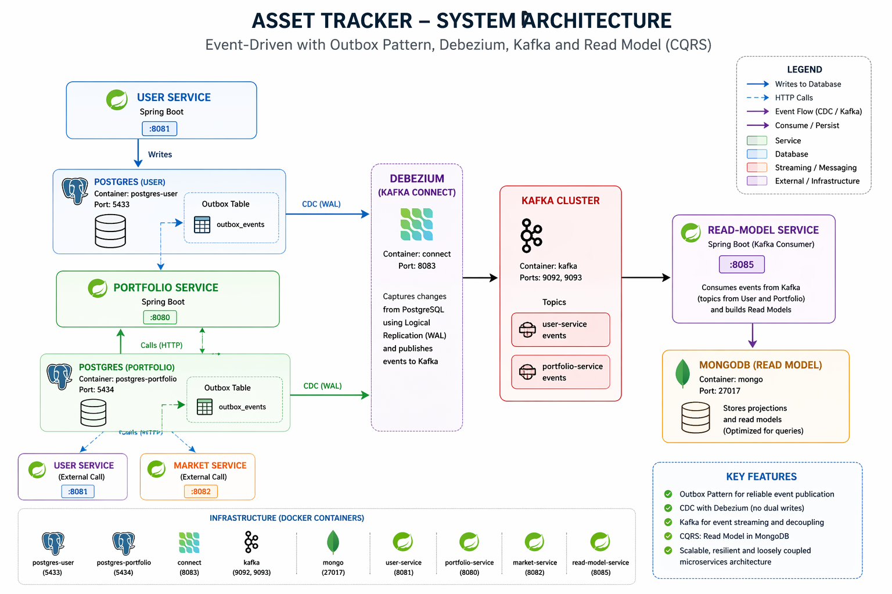

# Asset Tracker API

Backend distribuido para gestionar y valorar activos digitales y físicos (criptomonedas, metales preciosos, etc.) mediante una arquitectura de microservicios basada en eventos.

| Servicio           | Repositorio                                                                 | Descripción                                           |
|--------------------|------------------------------------------------------------------------------|-------------------------------------------------------|
| Portfolio Service  | [🔗 Ver repo](https://github.com/Yerai-Araujo/asset-tracker-api-portfolio-service)  | Gestiona portfolios, activos y operaciones            |
| User Service       | [🔗 Ver repo](https://github.com/Yerai-Araujo/asset-tracker-api-user-service)       | Maneja autenticación y usuarios                       |
| Market Service     | [🔗 Ver repo](https://github.com/Yerai-Araujo/asset-tracker-api-market-service)     | Provee precios de mercado (cripto, metales)          |
| Read Model Service | [🔗 Ver repo](https://github.com/Yerai-Araujo/asset-tracker-api-read-model-service) | Construye vistas optimizadas para consulta (CQRS)    |

# Descripción general de la arquitectura

Este sistema implementa una arquitectura Event-Driven + CQRS utilizando:

- Outbox Pattern para evitar dual writes
- Debezium (CDC) para capturar cambios en la base de datos
- Kafka como event bus
- MongoDB como base de datos optimizada para lectura

# Tech Stack

## Backend
- Java + Spring Boot
- Spring Data JPA
- Spring Kafka

## Data & Streaming
- PostgreSQL
- MongoDB (Read Model)
- Apache Kafka
- Debezium (CDC)

## Infraestructura
- Docker & Docker Compose (El sistema se ejecuta completamente con Docker)

# Key Features

- Event-Driven Architecture
- CQRS (Command Query Responsibility Segregation)
- Outbox Pattern (consistencia garantizada)
- CDC con Debezium (sin dual writes)
- Escalabilidad y bajo acoplamiento
- Read models optimizados para consultas

# Author

Software Engineer especializado en:

- Microservices
- Event-Driven Systems
- Backend con Java & Spring Boot